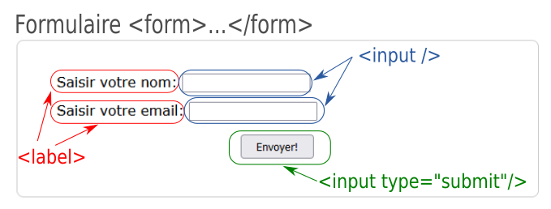
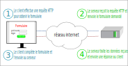

Les formulaires
================

.. _`le formulaire`: https://developer.mozilla.org/fr/docs/Web/HTML/Element/Form
.. _`le champ input`: https://developer.mozilla.org/fr/docs/Web/HTML/Element/Input"
.. _`le bouton radio`: https://developer.mozilla.org/fr/docs/Web/HTML/Element/Input/radio

Les formulaires dans les pages web permettent de recueillir des informations et sont très utilisés.

Un formulaire est ajouté avec les balises ``<form>`` et ``</form>``. Les champs de saisies et les boutons sont créés avec les balises ``<input>``. Ces balises sont différenciées en affectant un attribut ``type``. 

Les différents types sont:

- le type ``text`` qui va permettre la saisie d'un texte.
- le type ``number`` qui va permettre la saisie d'un nombre.
- le type ``email`` qui permet de saisir une adresse mail.
- le type ``password`` qui permet de saisir un mot de passe.
- le type ``radio`` qui permet de sélectionner une seule valeur parmi plusieurs valeurs.
- le type ``checkbox`` qui permet de sélectionner plusieurs valeurs en cochant des cases.
- le type ``list`` qui permet de choisir une valeur dans une liste déroulante.

L'affichage du bouton de validation (soumission) de formulaire se fait avec la balise ``input`` en y ajoutant le type ``submit``.

Pour chaque champ, il est souvent utile d'associer un texte invitant à la saisie. Ces textes sont insérés avec les balises ``<label>``.

On donne le code html du formulaire représenté sur la figure ci-dessus.

.. code-block:: html
   
   <form>
         <label for="name">Saisir votre nom: </label>
         <input type="text" name="name" id="name" required>

         <label for="email">Saisir votre email: </label>
         <input type="email" name="email" id="email" required>

         <input class="bouton" type="submit" value="Envoyer!">
   </form>

.. warning::

   Pour obtenir exactement l'apparence du formulaire, des balises ``
`` et ``
`` ont été ajoutées avec des propriétés ``css`` comme le montre le code complet ci-dessous.

   .. code-block:: html
      
      <form class="form-example">
         

            <label for="name">Saisir votre nom: </label>
            <input type="text" name="name" id="name" required>
         

         

            <label for="email">Saisir votre email: </label>
            <input type="email" name="email" id="email" required>
         

         

            <input class="bouton" type="submit" value="Envoyer!">
         

      </form>

.. hint::

   Une documentation sur les formulaires existe sur le site de la fondation Mozilla:

   -  Les formulaires en html: `le formulaire`_
   -  Les champs ``input``: `le champ input`_
   -  Les boutons radios: `le bouton radio`_
  
Serveur web ou serveur http
-----------------------------

Un formulaire a pour but de transmettre des données entre un ``client`` et un ``serveur web``. Le processus se décompose en 4 temps :

Le serveur web ou serveur http dispose d'un programme qui traite les données qu'il reçoit du client. 

Lorsqu'on valide un formulaire d'une page web, une requête http est envoyée contenant les données saisies dans le formulaire. Cette requête contient alors la **méthode** utilisée et comme **ressource**, le nom du programme qui doit traiter les données. 

La méthode et la ressource utilisées sont indiquées dans le formulaire avec les attributs ``action`` et ``method`` ajoutés à la balise ``<form>``. En reprenant le formulaire précédent:

.. code-block:: html
   
   <form action="traitement" method="post" class="form-example">
      ...
   </form>

.. important::

   La méthode utilisée dans la requête d'envoi est en général la méthode ``POST``. Cette méthode envoie les données dans le corps de la requête ce qui assure une certaine confidentialité. 

   La méthode ``GET`` peut être utilisée mais est fortement déconseillée puisque les données sont ajoutées à l'url.