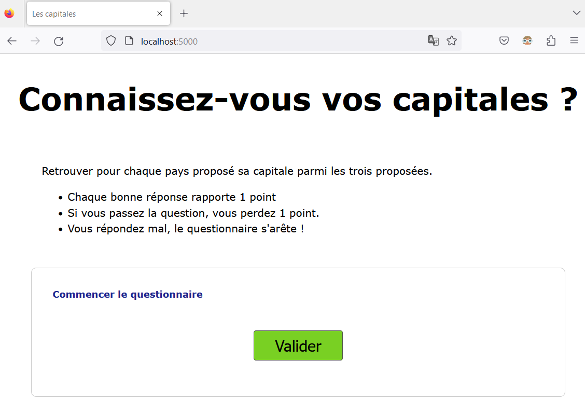
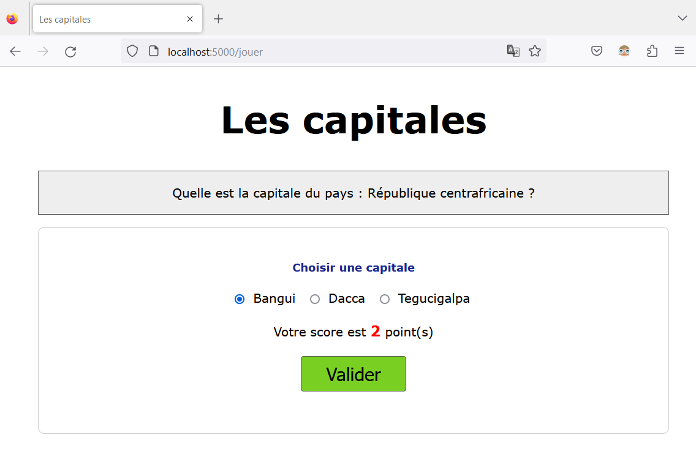
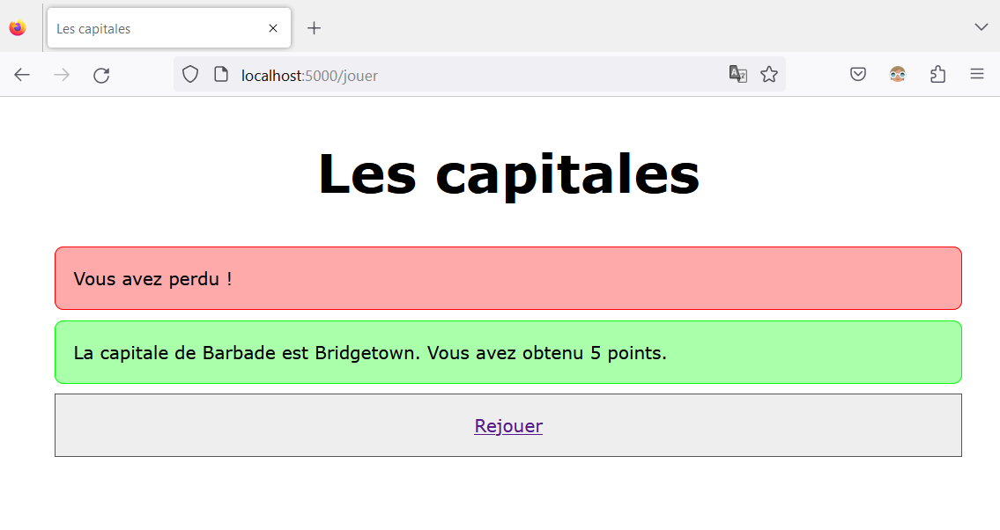

TP : les capitales
========================

Ce TP utilise le fichier ``capitales.py`` qui contient le dictionnaire ``capitales`` dont les clés sont les noms de pays et les valeurs associées sont les capitales.

.. code:: python

    capitales = {   
        'Afghanistan': 'Kaboul', \
        'Afrique du Sud': 'Pretoria/le Cap', \
        'Albanie': 'Tirana', \
        'Algérie': 'Alger', \
        'Allemagne': 'Berlin', \
        'Andorre': 'Andorre la vieille', \
        'Angola': 'Luanda', \
        ...
        'Venezuela': 'Caracas', \
        'Viêt Nam': 'Hanoï', \
        'Yémen': 'Sanaa', \
        'Zambie': 'Lusaka', \
        'Zimbabwe': 'Harare' \
    }

On importe ce dictionnaire avec l'instruction python:

.. code::

    from capitales import capitales

L'objectif est d'écrire des fonctions qui permettent de choisir au hasard un pays et des capitales pour les proposer sous forme d'un questionnnaire à choix multiple (QCM).

Une interface Web est utilisée pour améliorer l'ergonomie du jeu. 

    Page d'accueil de l'interface

.. figure:: ../img/jeu_capitales_2.png
    :align: center

    Questionnaire du jeu

    Le score après chaque questionnnaire

    Fin de partie

Cette interface est disponible sur l'ENT et doit être décompressée dans votre dossier de travail. 

.. important::

    Seul le fichier nommé ``fonctions.py`` est à modifier. Tous les autres fichiers de l'interface Web ne doivent pas être modifiés.

Le fichier ``fonctions.py`` contient 4 fonctions à compléter pour ce jeu de questions. On donne ci-dessous le code avant modification:

.. literalinclude:: ../python/serveur_HTTP/fonctions.py

#.  La fonction ``choisir_pays(dico)`` prend en paramètre un dictionnaire ``dico`` et renvoie une clé du dictionnaire choisie aléatoirement. Par exemple, avec le dictionnaire ``capitales`` :

    >>> choisir_pays(capitales)
    France

    >>> choisir_pays(capitales)
    Venezuela

    Compléter la fonction ``choisir_pays(dico)`` dans le fichier ``fonctions.py``.

#.  La fonction ``choisir_capitale(dico)`` prend en paramètre un dictionnaire ``dico`` et renvoie une valeur du dictionnaire choisie aléatoirement.

    >>> choisir_capitale(capitales)
    Berlin

    >>> choisir_capitale(capitales)
    Caracas

    Compléter la fonction ``choisir_capitale(dico)`` dans le fichier ``fonctions.py``.

#.  La fonction ``verifier_dico(dico,cle,valeur)`` renvoie un booléen. Celui-ci vaut ``True`` si ``valeur`` est bien associée à ``cle`` dans le dictionnaire ``dici``. Dans le cas contraire la fonction renvoie ``False``. La fonction renvoie aussi ``False`` si la valeur est vide.

#.  La dernière fonction ``questionnaire(dico)`` renvoie un dictionnaire dont les clés sont ``pays``, ``rep0``, ``rep1`` et ``rep2``. Les valeurs associées à ces clés sont les suivantes:

    -   un pays choisi au hasard dans le dictionnaire ``capitales``
    -   la capitale du pays choisi précédemment
    -   deux autres capitales choisies au hasard dans le dictionnaire ``capitales``

    Les trois capitales sont placées dans un tableau ``villes_reponses`` qui est trié ou mélangé avant que les valeurs soient attribuées aux clés ``rep0``, ``rep1`` et ``rep2``.

#.  Lancer le questionnaire en exécutant le fichier ``serveur.py`` dans Thonny puis utiliser un navigateur pour afficher le questionnaire à l'adresse ``http://localhost:5000``.

#.  Vérifier le bon fonctionnement du questionnaire. En répétant à plusieurs reprises le questionnaire, on peut observer 2 problèmes.

    -   La répétition d'une même questionnaire
    -   Avoir 2 fois la même capitale dans une réponse.

    Apporter, si possible des correctifs pour éviter ces situations.